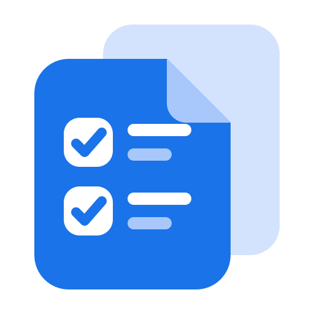
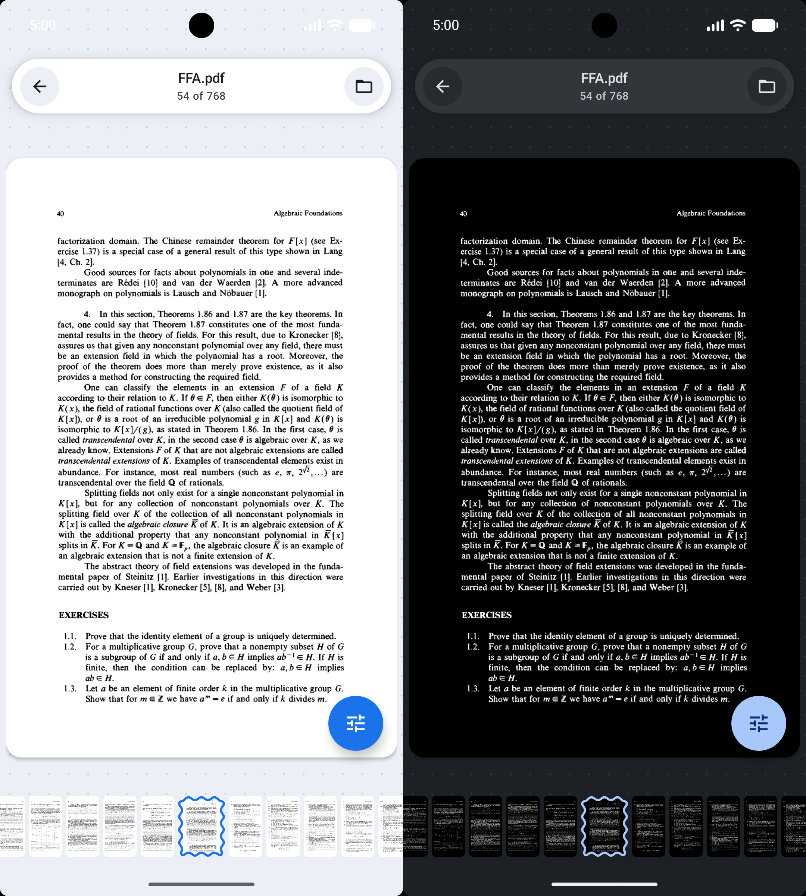
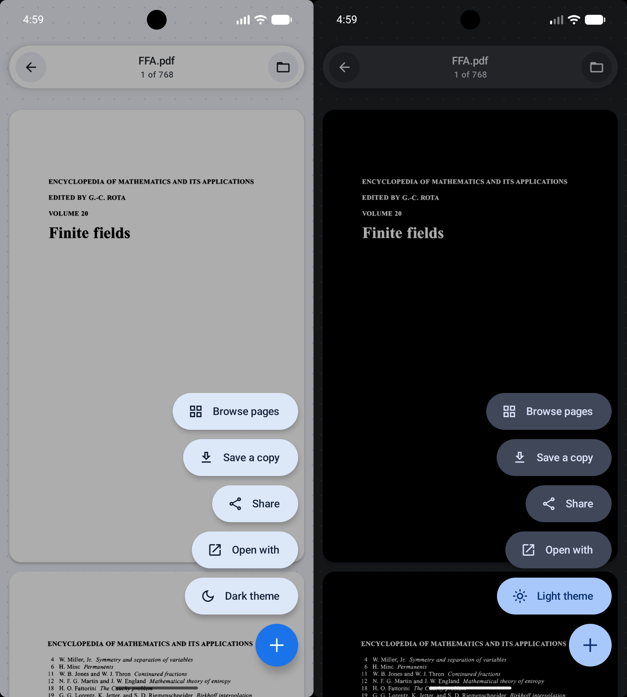
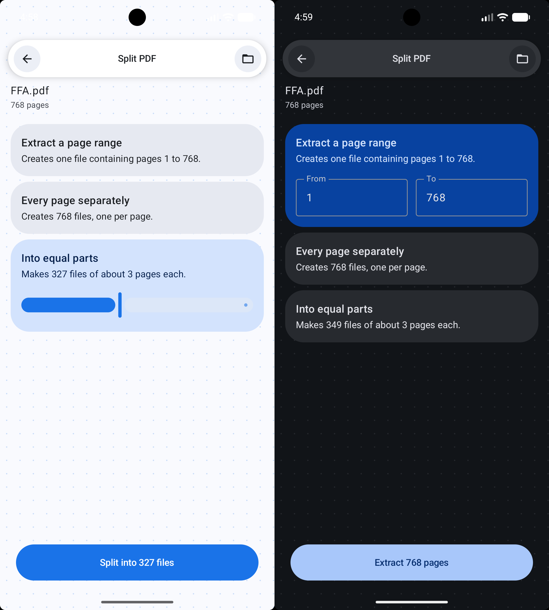
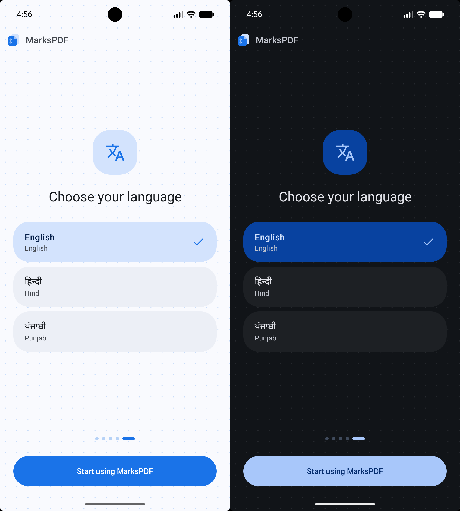
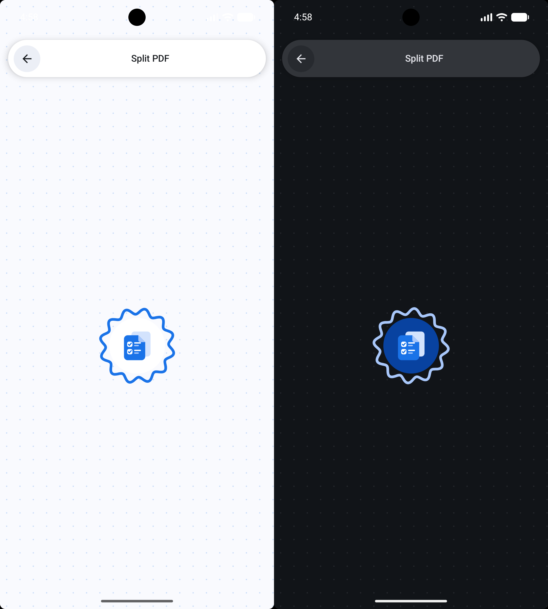

<div align="center">



# MarksPDF

**A fast, offline PDF reader and toolkit for Android.**

Read, merge, split, and convert PDFs without a single file ever leaving your phone.

<br>


</div>

<br>

## Screenshots

<div align="center">

|                   Home                   | Reading | Tools |
|:----------------------------------------:|:---:|:---:|
|  |  |  |

| Split | Language | Loading |
|:---:|:---:|:---:|
|  |  |  |

</div>

<br>

## What it does

**Read** — Continuous scrolling or page-by-page, pinch to zoom, double-tap to fit. A
thumbnail filmstrip along the bottom for jumping around long documents. Tap the page and
every control gets out of the way.

**Merge** — Combine any number of PDFs into one. Reorder before you commit; the position
number is shown on every row, because the wrong order is the one mistake that produces a
file which looks correct and isn't.

**Split** — Three ways, all on one screen: extract a page range, break every page into its
own file, or divide the document into equal parts. Each option says what it will produce
before you run it.

**Images to PDF** — Turn photos or scans into a document. Pages either match each image's
proportions or sit centred on A4, ready to print.

**PDF to images** — Export every page as JPG or PNG at screen or print resolution. Pages go
into a folder named after the document, so they stay together.

**Night mode** — Inverts pages at draw time rather than re-rendering them, so switching is
instant on a 700-page file.

<br>

## Things worth knowing

**Nothing is uploaded.** Every tool runs on the device. The app requests no network
permission at all, which means the guarantee is enforced by Android rather than promised
by the developer.

**Output goes somewhere you can find it.** Files are written to `Downloads/MarksPDF` through
MediaStore, not hidden in app-private storage where they would vanish on uninstall.

**Three languages.** English, हिन्दी, and ਪੰਜਾਬੀ, switchable from the home screen without
changing the system language.

<br>

## Building

```bash
git clone https://github.com/<your-username>/MarksPDF.git
cd MarksPDF
./gradlew assembleDebug
```

The APK lands in `app/build/outputs/apk/debug/`.

For a release build, create `keystore.properties` in the project root:

```properties
storeFile=/absolute/path/to/your-release.jks
storePassword=...
keyAlias=...
keyPassword=...
```

then run `./gradlew assembleRelease`. The file is gitignored — keep it and the keystore out
of version control.

<br>

## Built with

| | |
|---|---|
| **Kotlin + Jetpack Compose** | Entire UI, no XML layouts |
| **Material 3** | Single blue scheme, light and dark, no dynamic colour |
| **PdfRenderer** | Page rasterising — hardware-accelerated, but read-only |
| **PDFBox-Android** | Everything that writes: merge, split, image import |
| **ExifInterface** | Photo orientation, which cameras record as a tag rather than in the pixels |

The reader and the editor deliberately use different engines. `PdfRenderer` is the fastest
way to get pixels on screen and cannot modify a file; PDFBox can rewrite documents and has
no renderer on Android. Keeping them apart means reading stays quick however much editing
machinery is added.

<br>

## Project layout

```
core/pdf/        Rendering, page cache, merge/split/convert, output storage
core/settings/   Language choice, first-run state
feature/home/    Tool grid and recent documents
feature/viewer/  Reader, zoom, thumbnail rail
feature/merge/   ...and split/, images/, onboarding/
ui/components/   Shared pills, loader, scaffold, slider
ui/theme/        Colour, shape, motion
```

<br>

## License

[MIT](LICENSE) — do what you like with it.

<br>

<div align="center">

Made by **Kunal Sharma**

</div>
